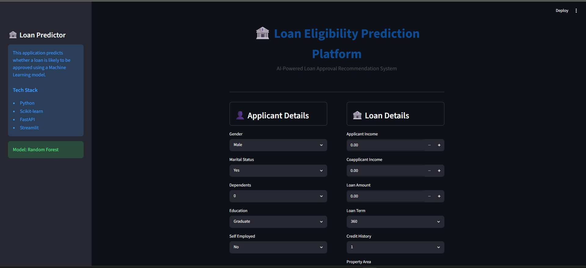
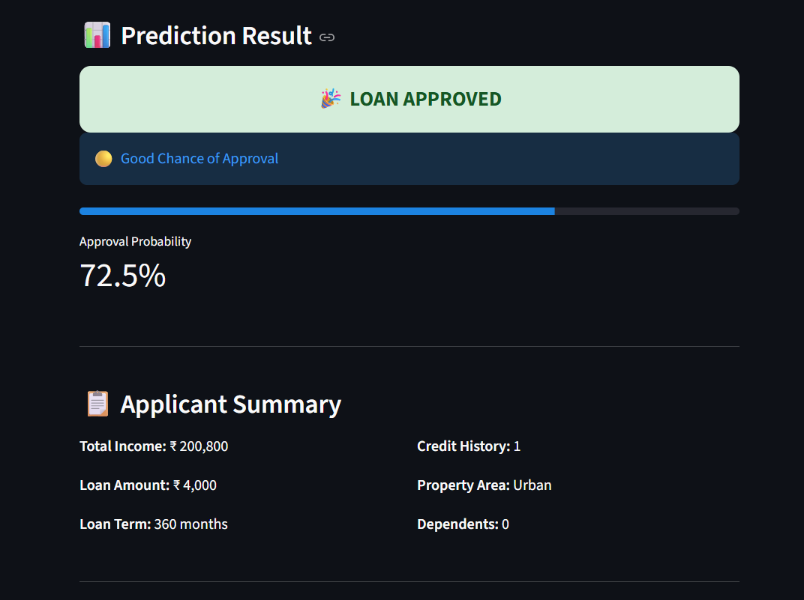
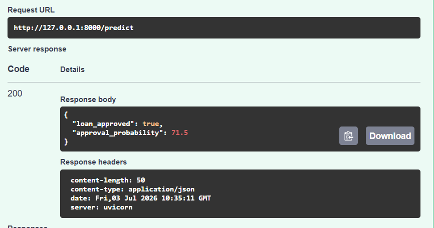

# 🏦 Loan Eligibility Prediction Platform

An end-to-end Machine Learning web application that predicts whether a loan application is likely to be approved based on applicant information.

The project demonstrates the complete Machine Learning lifecycle including data preprocessing, feature engineering, model training, REST API development using FastAPI, and an interactive frontend built with Streamlit.

---
## 🌐 Live Demo

- 🚀 **Web App:** https://drishtiiii-loan-eligibility-predictor-streamlit-app-rbbm4g.streamlit.app/
- 📖 **Swagger API:** https://loan-eligibility-api-bj5j.onrender.com/docs
- 💻 **GitHub Repository:** https://github.com/drishtiiii/loan-eligibility-predictor


# 📌 Features

- Predicts loan approval using a trained Machine Learning model
- FastAPI backend with REST API
- Interactive Streamlit frontend
- Feature engineering for better prediction accuracy
- Approval probability score
- Applicant summary dashboard
- Swagger API documentation
- Clean and responsive user interface

---

## 🚀 Tech Stack

- **Languages:** Python
- **Machine Learning:** Scikit-learn, Pandas, NumPy
- **Backend:** FastAPI, Uvicorn, Pydantic
- **Frontend:** Streamlit
- **Deployment:** Render, Streamlit Community Cloud
- **Containerization:** Docker, Docker Compose

---

# 📂 Project Structure

```
loan-eligibility-predictor/
│
├── app/
│   ├── config.py
│   ├── inference.py
│   ├── main.py
│   ├── preprocess.py
│   └── schemas.py
│
├── artifacts/
│   ├── model.pkl
│   ├── scaler.pkl
│   └── feature_columns.pkl
│
├── data/
│   ├── train.csv
│   └── processed_loan_data.csv
│
├── notebooks/
│   └── EDA.ipynb
│
├── screenshots/
│
├── tests/
│
├── requirements.txt
├── streamlit_app.py
├── Dockerfile
└── README.md
```

---

# ⚙️ Installation

```bash
git clone https://github.com/drishtiiii/loan-eligibility-predictor.git

cd loan-eligibility-predictor

pip install -r requirements.txt
```
---

# ▶️ Run FastAPI

```bash
python -m uvicorn app.main:app --reload
```

FastAPI will run at

```
http://127.0.0.1:8000
```

Swagger Documentation

```
http://127.0.0.1:8000/docs
```

---

# ▶️ Run Streamlit

```bash
streamlit run streamlit_app.py
```
## Running with Docker

Build the image

```bash
docker build -t loan-eligibility-api .
```

Run the container

```bash
docker run -p 8000:8000 loan-eligibility-api
```

Using Docker Compose

```bash
docker compose up
```

---

# 📸 Screenshots

## Streamlit Dashboard



---

## Prediction Result



---

## Swagger API



---

# 📊 Machine Learning Pipeline

```

Raw Data
      ↓
Preprocessing
      ↓
Feature Engineering
      ↓
Scaling
      ↓
Random Forest
      ↓
FastAPI
      ↓
Streamlit

```

# 📈 Engineered Features

The application automatically generates:

- Total Income
- Log Income
- Log Loan Amount
- EMI
- Loan-to-Income Ratio
- Income per Dependent

These engineered features improve the predictive performance of the model.

---

```
## 🧪 API

POST `/predict`

Returns:

```json
{
    "loan_approved": true,
    "approval_probability": 71.5
}
```

Interactive API documentation is available through Swagger:
https://loan-eligibility-api-bj5j.onrender.com/docs


```
# 🔮 Future Improvements

- Explainable AI using SHAP
- Loan recommendation engine
- User authentication
- Database integration
- CI/CD using GitHub Actions
- AWS deployment with monitoring

```

# 👩‍💻 Author

**Drishti Saha**

GitHub:
https://github.com/drishtiiii

LinkedIn:
https://www.linkedin.com/in/drishti-saha/


## 🎯 Project Highlights

- End-to-end Machine Learning workflow
- RESTful API using FastAPI
- Interactive Streamlit web application
- Dockerized for consistent deployment
- Backend deployed on Render
- Frontend deployed on Streamlit Community Cloud
- Tested with Swagger/OpenAPI