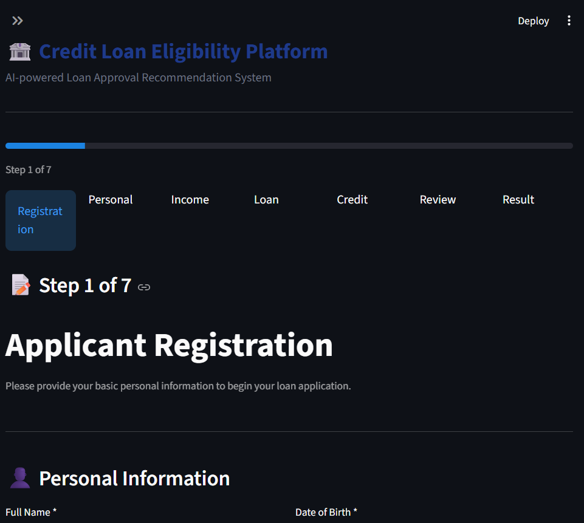
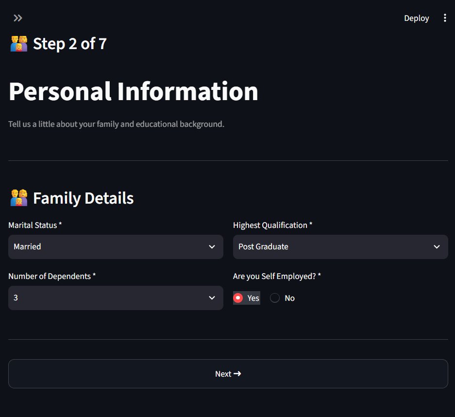
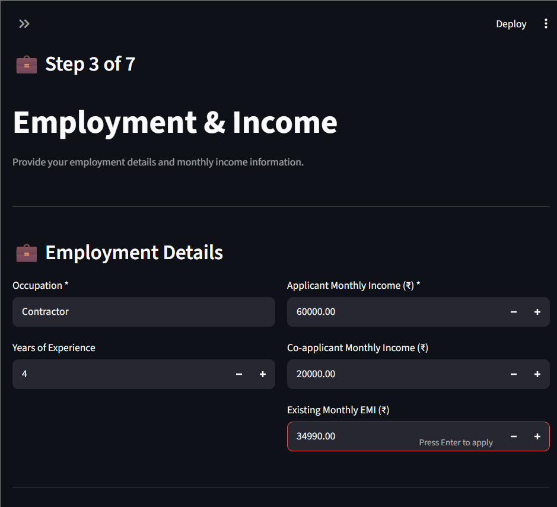
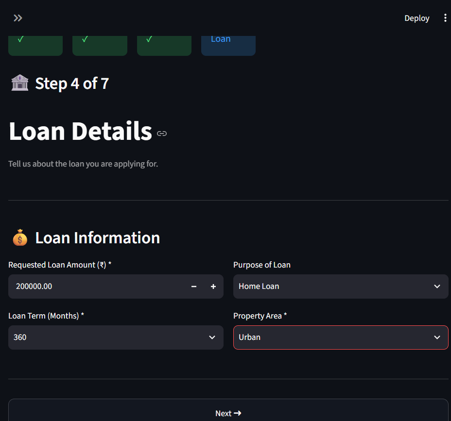
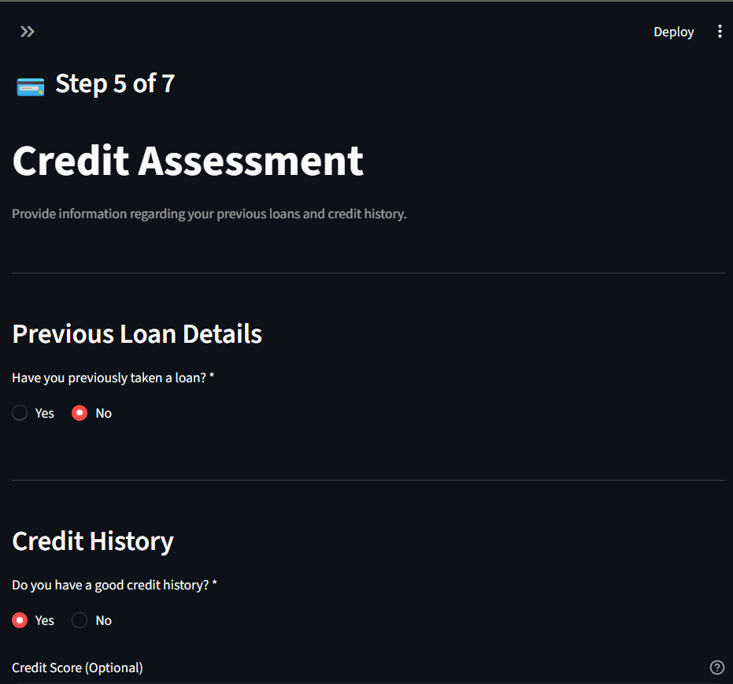
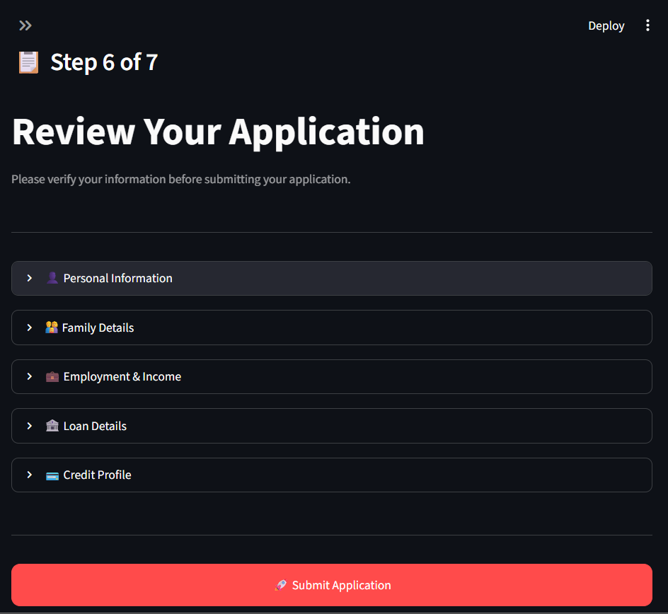
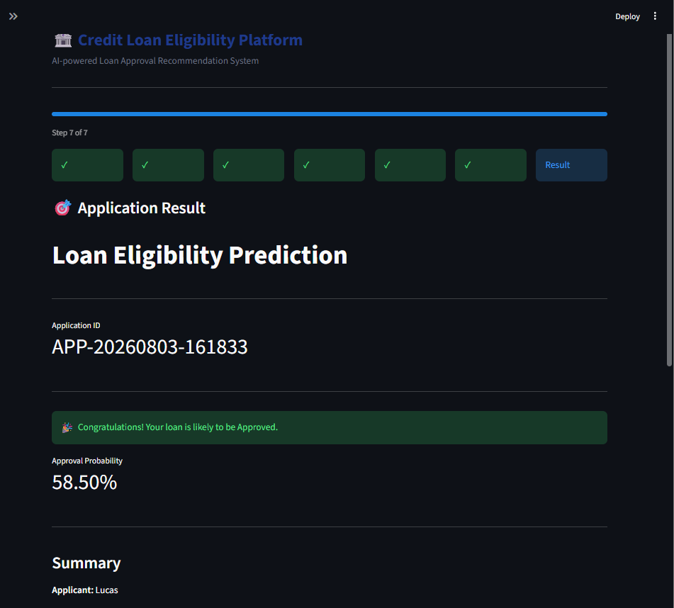

# AI Enabled Loan Eligibility Predictor

A Machine Learning-powered Loan Eligibility Prediction System built using **FastAPI**, **Streamlit**, and **Scikit-Learn**. The application allows users to complete a multi-step loan application form, reviews the entered information, and predicts whether the loan is likely to be approved.

---

## 📌 Features

- 📝 Multi-step loan application form
- ✅ Input validation at every step
- 💾 Persistent session state across pages
- 📋 Review application before submission
- 🤖 Machine Learning prediction using Random Forest
- ⚡ FastAPI backend for inference
- 🎨 Clean and responsive Streamlit interface
- 📊 Probability score for loan approval

---

## 🌐 Live Demo

### 🚀 Frontend

https://loan-eligibility-predictor-scqw5frsse7kzfbvpcyq5e.streamlit.app/

### ⚡ Backend API

https://loan-eligibility-predictor-ksgq.onrender.com/

### 📖 API Documentation

https://loan-eligibility-predictor-ksgq.onrender.com/docs

---

## 🛠 Tech Stack

### Frontend
- Streamlit
- Python

### Backend
- FastAPI
- Uvicorn

### Machine Learning
- Scikit-Learn
- Random Forest Classifier
- Pandas
- NumPy
- Joblib

---

## 📂 Project Structure

```
loan-eligibility-predictor/
│
├── app/
│   ├── main.py
│   ├── inference.py
│   ├── preprocess.py
│   ├── schemas.py
│   ├── config.py
│   └── model.pkl
│
├── frontend/
│   ├── app.py
│   ├── pages/
│   ├── components/
│   ├── utils/
│   └── assets/
│
├── notebooks/
├── dataset/
├── requirements.txt
└── README.md
```

---

## 🚀 Application Workflow

```
User Registration
        │
        ▼
Personal Information
        │
        ▼
Employment & Income
        │
        ▼
Loan Details
        │
        ▼
Credit Assessment
        │
        ▼
Review Application
        │
        ▼
FastAPI Backend
        │
        ▼
Random Forest Model
        │
        ▼
Prediction Result
```

---

## 📸 Screenshots


### Registration

<p align="center">

</p>

---

### Personal Information

<p align="center">

</p>

---

### Employment & Income

<p align="center">

</p>

---

### Loan Details

<p align="center">

</p>

---

### Credit Assessment

<p align="center">

</p>

---

### Review Application

<p align="center">

</p>

---

### Prediction Result

<p align="center">

</p>

---

## ⚙️ Installation

### Clone Repository

```bash
git clone https://github.com/yourusername/loan-eligibility-predictor.git

cd loan-eligibility-predictor
```

### Create Virtual Environment

```bash
python -m venv .venv
```

### Activate Environment

Windows

```bash
.venv\Scripts\activate
```

Linux / Mac

```bash
source .venv/bin/activate
```

### Install Dependencies

```bash
pip install -r requirements.txt
```

---

## ▶️ Run Backend

```bash
python -m uvicorn app.main:app --reload
```

Backend runs at

```
http://127.0.0.1:8000
```

---

## ▶️ Run Frontend

```bash
streamlit run frontend/app.py
```

Frontend runs at

```
http://localhost:8501
```

---

## 🧠 Machine Learning Model

The prediction model is a **Random Forest Classifier** trained on a public Loan Eligibility dataset.

### Features Used

- Gender
- Marital Status
- Dependents
- Education
- Self Employment
- Applicant Income
- Co-applicant Income
- Loan Amount
- Loan Term
- Credit History
- Property Area

### Engineered Features

- Total Income
- Log Income
- Log Loan Amount
- EMI
- Loan-to-Income Ratio
- Income per Dependent

---

## 📈 Prediction Output

The model returns:

- Loan Approval Status
- Approval Probability

---

## 💡 Future Improvements

- User Authentication
- Application History
- Database Integration
- Explainable AI (SHAP/LIME)
- Model Comparison
- Docker Support
- Cloud Deployment

---

## 👩‍💻 Author

**Drishti Saha**

GitHub: https://github.com/drishtiiii

LinkedIn: https://www.linkedin.com/in/drishti-saha/

---

## ⭐ If you like this project

Give it a ⭐ on GitHub!
